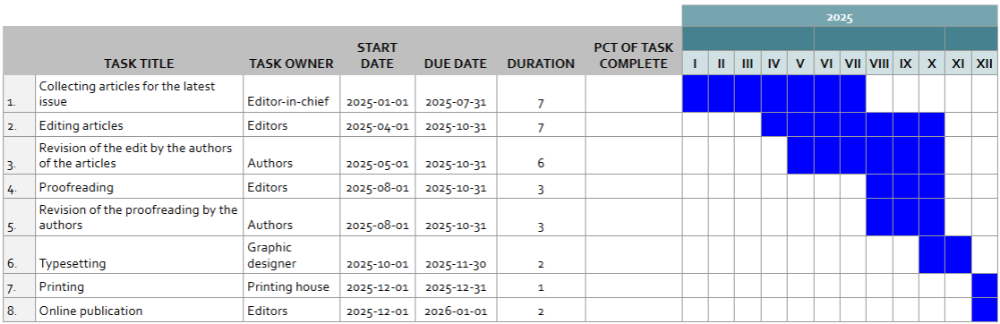

# Zarządzanie zadaniami w procesie wydawniczym

Efektywna publikacja naukowa wymaga **jasno określonych etapów pracy** i **sprawnej koordynacji zadań**. Wizualizacja procesów pozwala na lepsze śledzenie postępów i eliminowanie opóźnień.

## Jak skutecznie zarządzać zadaniami?

✅ Monitoruj status artykułów (np. zgłoszenie → recenzja → korekta → skład → publikacja) i przeprowadzaj regularną rewizję.

✅ Korzystaj z systemu automatycznych powiadomień.&#x20;

✅ Wprowadź jasne zasady priorytetyzacji zadań, które pomagają skupić się na najważniejszych działaniach.

Dzięki odpowiedniej wizualizacji procesu i dopasowanym narzędziom praca nad publikacjami staje się bardziej przejrzysta, efektywna i zorganizowana. Tablice projektowe oraz diagramy pomagają zespołom redakcyjnym w lepszej koordynacji działań i ustalaniu priorytetów. 

### Przykłady narzędzi do wizualizacji procesu:&#x20;

📌 Typu **Kanban** (np. [Google TasksBoard](https://tasksboard.com/), [Trello](https://trello.com/), [Jira](https://www.atlassian.com/pl/software/jira), [Asana](https://asana.com/)) – umożliwiają podział na etapy pracy (przykładowe kolumny: „Recenzja”, „Korekta”, „Skład”) oraz tworzenie list kontrolnych i przypomnień.

<figure><figcaption>
Przykładowa tablica Kanban stworzona w narzędziu Miro wizualizująca status poszczególnych artykułów
</figcaption></figure>

📌 **Gantt Chart** (np. MS Excel, Google Spreadsheet, [ClickUp](https://clickup.com/)) – wykres słupkowy ilustrujący harmonogram projektu; umożliwia wizualizację zależności między poszczególnymi etapami.

<figure><figcaption>
Przykład zastosowania wykresu Gantta dla procesu publikacji
</figcaption></figure>

***

### 💡Pytania do refleksji:&#x20;

1. Czy mamy jasno określony status każdego artykułu w procesie wydawniczym?
2. Jakie narzędzia do zarządzania zadaniami mogłyby najbardziej usprawnić naszą pracę nad publikacjami?
3. Czy istnieje miejsce na usprawnienie procesu dzięki automatycznym przypomnieniom i powiadomieniom?
