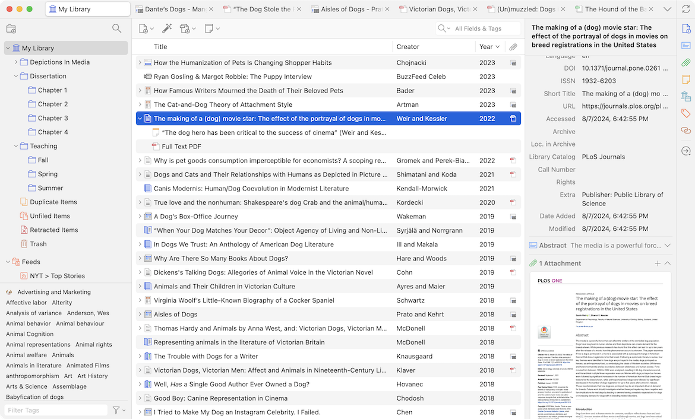

# Zarządzanie bibliografiami

Zarządzanie literaturą jest kluczowe w pracy badawczej, szczególnie w środowisku akademickim, gdzie precyzyjne cytowanie źródeł i organizowanie materiałów ma ogromne znaczenie. Automatyzacja tego procesu minimalizuje ręczne formatowanie i korektę, a tym samym pozwala oszczędzić czas i zmniejsza ryzyko błędów.

Najpopularniejszym narzędziem do zarządzania bibliografiami jest [**Zotero**](https://www.zotero.org/). Jego najważniejsze możliwości to:

* Organizowanie literatury w jednym miejscu.
* Automatyczne pobieranie danych o źródłach z internetu.
* Tworzenie cytowań i bibliografii w różnych formatach.
* Import i eksport danych z różnych baz, np. JSTOR, Google Scholar, i formatów, takich jak BibTeX.
* Udostępnianie materiałów zespołowi.
* Integracja z przeglądarkami i synchronizacja danych między urządzeniami – dostęp do bibliografii z różnych miejsc.
* Możliwość dodawania tagów, tworzenia folderów, dodawania notatek i komentarzy do każdego źródła.
* Integracja z edytorami tekstów (np. Word) umożliwiająca bezpośrednie wstawianie cytatów i generowanie bibliografii.

<figure><figcaption>
Źródło: zotero.org
</figcaption></figure>

### Inne warte uwagi narzędzia:

📌 [Mendeley](https://www.mendeley.com/),&#x20;

📌 [EndNote](https://endnote.com/),&#x20;

📌 BibTex (dla LaTeX).

### Jak wdrożyć Zotero w kilku krokach

Poniżej znajdziesz prostą checklistę, która poprowadzi Cię krok po kroku od zera do pełnego wdrożenia Zotero.&#x20;

**1. Instalacja i konfiguracja**

✅  Pobierz i zainstaluj aplikację Zotero z oficjalnej strony: [https://www.zotero.org](https://www.zotero.org)\
✅  Zainstaluj **Zotero Connector** do swojej przeglądarki (Chrome / Firefox / Safari)\
✅  Załóż konto Zotero i zaloguj się w aplikacji – to pozwoli Ci korzystać z synchronizacji

**2. Pierwsze kroki z biblioteką**

✅  Stwórz folder (kolekcję) dla konkretnego projektu lub tematu\
✅  Dodaj kilka źródeł przez Zotero Connector (np. z Google Scholar, katalogu biblioteki, JSTOR)\
✅  Dodaj ręcznie jedno źródło, żeby zobaczyć, jak wygląda edycja danych bibliograficznych

**3. Organizacja**

✅  Przypisz **tagi** do źródeł – np. „teoria”, „badania własne”, „konceptualizacja”\
✅  Dodaj **notatki** do przynajmniej dwóch źródeł – zanotuj cytaty lub swoje przemyślenia\
✅  Poeksperymentuj z **wyszukiwaniem** źródeł w Twojej bibliotece (np. po tagach, autorze, słowie kluczowym)

**4. Synchronizacja i bezpieczeństwo**

✅  Włącz synchronizację z kontem online (Ustawienia → Sync)\
✅  Wybierz, czy chcesz przesyłać pełne pliki PDF do chmury Zotero (można też używać zewnętrznych chmur, np. WebDAV)

**5. Cytowanie i integracja z edytorem**

✅  Zainstaluj wtyczkę do edytora tekstu (np. Word, LibreOffice)\
✅  Otwórz dokument tekstowy i **wstaw pierwszy cytat** za pomocą Zotero\
✅  Wygeneruj **bibliografię** na końcu dokumentu – wybierz preferowany styl (APA, MLA, Chicago itd.)

**6. Współpraca**

✅  Stwórz **grupę Zotero** i zaproś współpracowników (np. z zespołu projektowego lub seminarium)\
✅ Udostępnij im folder z wybraną literaturą

🎯 **Gotowe?** Świetnie! W mniej niż godzinę możesz mieć uporządkowaną, zsynchronizowaną i gotową do pracy bibliotekę źródeł, z której skorzystasz w każdym projekcie naukowym, edytorskim czy redakcyjnym.

***

### 💡 Pytania do refleksji:

* Jak organizujesz swoją bibliografię? Czy robisz to ręcznie, czy używasz jakiegoś narzędzia?
* Czy kiedykolwiek zdarzyło Ci się stracić źródło lub mieć trudność z jego ponownym odnalezieniem? Jak mogłoby temu zapobiec Zotero?
* Jakie źródła najczęściej wykorzystujesz – artykuły naukowe, książki, strony internetowe? Czy Zotero wspiera ich szybkie dodawanie i uporządkowanie?
* Czy dzielisz się bibliografią z innymi członkami zespołu? Jak mogłaby w tym pomóc funkcja udostępniania grupowego?
