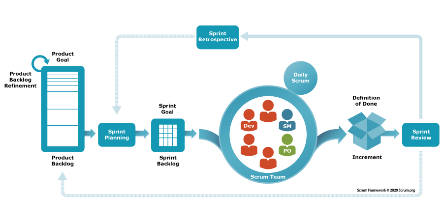

# Metody zarządzania projektem

### Workflow w procesie wydawniczym

W wydawnictwach workflow (przepływ prac), czyli proces wydawniczy to uporządkowany ciąg prac wydawniczych – od momentu zgłoszenia tekstu przez autora i omówieniu wszystkich jego oczekiwań aż do jego publikacji. Typowy workflow obejmuje uporządkowanie materiałów, recenzję, opracowanie redakcyjne i techniczne lub co najmniej korektę i skład, przygotowanie metadanych wg przyjętego schematu i dystrybucję tekstu w wersji drukowanej i elektronicznej. Dobrze zaplanowany i elastyczny przepływ pracy jest kluczowy w terminowości, jakości i przejrzystości całego procesu.

### Scrum w wydawnictwie

Agile (z ang. „zwinny”) to sposób organizacji pracy polegający na podziale zadań na mniejsze etapy i regularnym wprowadzaniu ulepszeń. Jedną z najpopularniejszych metod Agile jest **Scrum**, obecnie powszechnie stosowany w zarządzaniu projektami. Choć wywodzi się z branży IT, podejście to można z powodzeniem wykorzystywać także w wydawnictwach naukowych. Dzięki swojej elastyczności i pracy etapami pozwala ono usprawnić współpracę między autorami, recenzentami i redaktorami w procesie publikacji.

<figure><figcaption>
Schemat przepływu pracy w tradycyjnym zespole scrumowym. Źródło: <a href="https://www.scrum.org/resources/what-scrum-module">https://www.scrum.org/resources/what-scrum-module</a>
</figcaption></figure>

Scrum doskonale sprawdzi się w redakcjach publikujących artykuły w cyklach lub metodą „early view”. Proces wydawniczy jest podzielony na tzw. sprinty, czyli mniejsze etapy prac wydawniczych planowanych w krótkich odcinkach czasowych, podczas których realizowane są kluczowe zadania, np. weryfikacja nadesłanych publikacji, recenzje, korekta i skład.

Scrum zakłada jasno określone role oraz rytm pracy oparty na powtarzalnych wydarzeniach (tzw. ceremoniach), które można z powodzeniem przełożyć na realia redakcyjne. Poniżej przedstawiono, jak typowe elementy metody Scrum mogą funkcjonować w kontekście pracy wydawniczej:

* **Redaktor naczelny** jako **Product Owner** – wyznacza kierunek działań redakcji: ustala kolejność publikacji, decyduje, które artykuły mają pierwszeństwo, pilnuje zgodności tematycznej z profilem czasopisma lub numeru tematycznego. Może także zbierać i analizować opinie czytelników lub autorów, aby usprawniać proces publikacji.
* **Scrum Master** – w środowisku wydawniczym to osoba (np. sekretarz redakcji lub doświadczony redaktor), która koordynuje pracę zespołu, usuwa przeszkody organizacyjne (np. opóźnienia w recenzjach), dba o rytm pracy i wspiera zespół w stosowaniu zwinnych praktyk – np. przypomina o spotkaniach, pomaga wdrażać usprawnienia i utrzymuje przejrzystość procesów.
* **Scrum meetings** (daily, weekly) – krótkie spotkania zespołu, podczas których omawia się postępy, bieżące wyzwania i plany na najbliższe dni.&#x20;
* Po każdym sprincie ocenia się zrealizowane zadania (np. artykuły gotowe do publikacji) i przeprowadza **retrospektywę**, czyli spotkanie, podczas którego zespół omawia, co poszło dobrze, co można poprawić i jak lepiej zorganizować kolejny cykl pracy.


Więcej o metodzie Scrum: [https://www.scrum.org/](https://www.scrum.org/)


### Jak wdrożyć Scruma w redakcji? Zadania do przetestowania w zespole

1. **Zmapuj aktualny workflow** \
   Rozrysuj schemat procesu – od momentu zgłoszenia tekstu po jego publikację. Zidentyfikuj etapy, w których najczęściej dochodzi do opóźnień.
2. **Zorganizuj testowy sprint** \
   Wybierz np. dwutygodniowy okres i zaplanuj, które zadania zostaną zrealizowane. Ustal role: kto będzie pełnił funkcję Product Ownera i Scrum Mastera
3. **Wdrożenie tablicy Kanban** \
   Dobrze pracuje się, gdy można widzieć graficznie obraz przebiegających prac. Skorzystaj z narzędzi takich jak Trello, Jira czy Asana, aby wizualizować etapy pracy. (Więcej o tych narzędziach dowiesz się w sekcji [Zarządzanie zadaniami w procesie wydawniczym](https://ibl-pan.gitbook.io/craft-oa-training-materials/wydawca-korzystajacy-ze-specjalistycznej-infrastruktury-wydawniczej/organizacja-pracy/zarzadzanie-zadaniami-w-procesie-wydawniczym)).&#x20;
4. **Zaplanuj retrospektywę po każdym sprincie** \
   Po zakończeniu sprintu najważniejsza jest krótka analiza i podsumowanie prac wg schematu:&#x20;
   * Co poszło dobrze?
   * Co wymaga poprawy?
   * Jak możemy lepiej współpracować?


Aby sprawnie przeprowadzić retrospektywę, zalecamy korzystanie z narzędzi do pracy zespołowej takich jak [Miro](https://miro.com/), [MetroRetro](https://metroretro.io/) czy [EasyRetro](https://easyretro.io/).


### Nie tylko Scrum – inne metody zarządzania

W zależności od charakteru czasopisma, modelu publikacji i stylu pracy zespołu redakcyjnego, możliwe jest zastosowanie także innych metod zarządzania:

📌 **Kanban** – koncentruje się na wizualizacji etapów procesu redakcyjnego (np. „nadesłane”, „w recenzji”, „po korekcie”, „gotowe do publikacji”) i ułatwia śledzenie postępów prac nad poszczególnymi tekstami. Może być stosowany samodzielnie lub w połączeniu z elementami Scruma jako tzw. Scrumban, co daje większą elastyczność w organizacji pracy redakcji.

📌 **Waterfall** (model kaskadowy) – to podejście liniowe, w którym kolejne etapy procesu (np. przyjęcie tekstu → recenzja → korekta → skład → publikacja) następują po sobie w ustalonej kolejności. Sprawdza się zwłaszcza w redakcjach realizujących zamknięte numery czasopisma z wyraźnie określonymi terminami i harmonogramem.

***

### 💡Pytania do refleksji&#x20;

* Czy wszyscy w zespole wiedzą, na jakim etapie znajduje się dany tekst?
* Czy nasz model pracy pozwala elastycznie reagować na zmiany?
* Jak często analizujemy i usprawniamy proces redakcyjny?
* Jakie elementy Scruma już intuicyjnie stosujemy?

***
